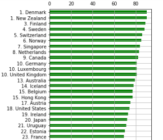
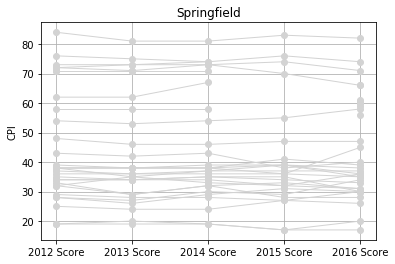
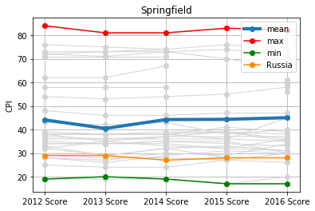
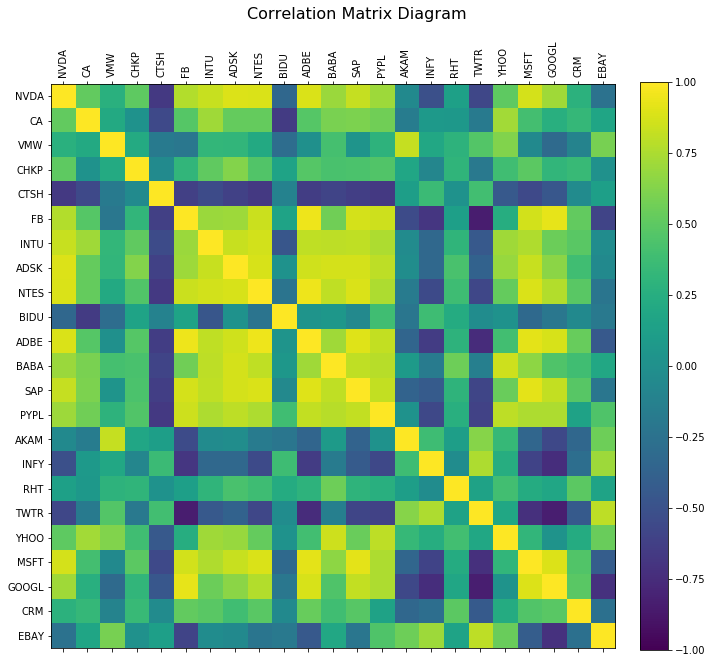
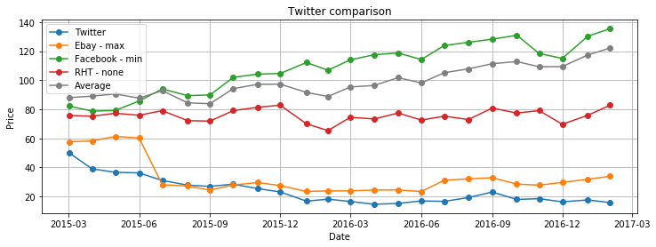

# ДОМАШНЕЕ ЗАДАНИЕ 1. Дескриптивный анализ данных

Папулин С.Ю. (papulin.study@yandex.ru)

## Цель работы

Приобрести опыт решения практических задач по анализу данных, таких как загрузка, трансформация, вычисление простых статистик и визуализация данных в виде графиков и диаграмм, посредством языка программирования Python.

## Вариант 

Чтобы узнать свой вариант, введите Вашу фамилию в соответствующее поле ниже и запустите ячейку:

```python
surname = "Иванов"  # Ваша фамилия

alp = 'абвгдеёжзийклмнопрстуфхцчшщъыьэюя'
w = [1, 42, 21, 21, 34,  6, 44, 26, 18, 44, 38, 26, 14, 43,  4, 49, 45,
        7, 42, 29,  4,  9, 36, 34, 31, 29,  5, 30,  4, 19, 28, 25, 33]

d = dict(zip(alp, w))
variant =  sum([d[el] for el in surname.lower()]) % 40 + 1

print("Задача № 1, шаг 5 - вариант: ", variant % 5 + 1)
print("Задача № 1, шаг 11 - вариант: ", variant % 2 + 1 )
print("задача № 2 - вариант: ", variant % 4 + 1)
```

## Задание 1. Анализ индикаторов качества государственного управления (The Worldwide Government Indicators, WGI) (6 баллов)

В качестве индикатора далее необходимо использовать контроль над коррупцией (Control of Corruption) и его показатели `pctrank` и `estimate`

- Набор данных:
    - [WGI](https://www.worldbank.org/content/dam/sites/govindicators/doc/wgidataset_excel.zip)
    - [Регионы](../data/A1_Descriptive_Analysis/regions.xlsx)
- [Описание WGI](http://info.worldbank.org/governance/wgi/)

⚠️ **Замечание.** Исходный файл с данными редактировать нельзя.

1. Загрузите данные в DataFrame
2. Отсортируйте данные по убыванию `pctrank`
3. Отобразите данные по индексу WGI за 2023 год в виде горизонтального столбчатого графика (`pctrank`). Примерный вид графика приведен ниже

    

5. Сформируйте DataFrame из исходного для региона в соответствии с Вашим вариантом</p>
    - Вариант 1. Asia Pacific
    - Вариант 2. Americas
    - Вариант 3. Europe and Central Asia
    - Вариант 4. Middle East and North Africa
    - Вариант 5. Sub Saharan Africa

6. Выведите данные DataFrame'a
7. Постройте графики индекса WGI за 1996-2023 для стран своего региона (`estimate`). Примерный вид графика приведен ниже

    

8. Найдите страны с наибольшим и наименьшим значением WGI Вашего варианта региона за 2023 год (`estimate`)

    ⚠️ **Замечание.** У нескольких стран может быть одна и та же позиция в рейтинге из-за одинаковых значений индекса

9. Определите средние значения региона за каждый год в период с 1996 по 2023 (`estimate`)

10. Постройте графики индекса WGI за 1996-2023 для стран своего региона и выделите страны с наибольшим и наименьшим значением WGI за 2023 год, а также отобразите среднее значение по региону и РФ. Примерный вид графика приведен ниже



11. Определите, как изменилось значение показателя `rank` с 1996 по 2023 (`rank`)

12. Выведите таблицу для ***Вашего варианта*** (WGI - `rank`)

<table border="1" class="dataframe">  <thead>    <tr style="text-align: right;">      <th></th>      <th>Регион</th>      <th>Страна</th>      <th>WGI 1996</th>      <th>WGI 2023</th>      <th>Изменение (см. пункт 11)</th>    </tr>  </thead>  <tbody>    <tr>      <th>mean_2023</th>      <td>-</td>      <td>-</td>      <td>-</td>      <td>-</td>      <td>-</td>    </tr>    <tr>      <th>max_2023</th>      <td>-</td>      <td>-</td>      <td>-</td>      <td>-</td>      <td>-</td>    </tr>    <tr>      <th>min_2023</th>      <td>-</td>      <td>-</td>      <td>-</td>      <td>-</td>      <td>-</td>    </tr>    <tr>      <th>Russia_2023</th>      <td>-</td>      <td>-</td>      <td>-</td>      <td>-</td>      <td>-</td>    </tr>  </tbody></table>

13. Отобразите диаграмму размаха (`boxplot`) индекса WGI за 2023 для всех стран и для каждого региона в отдельности (на одном графике) (`estimate`)

## Задача 2. Анализ рынка акций (4 балла)

1. Загрузите данные в один dataframe из всех файлов в папке /data/stock. Все файлы имеют одинаковую структуру, в том числе наименование столбцов. В качестве значений индекса dataframe'а необходимо указать значения столбца "Date". Название столбцов должные соответствовать названию акций (имя файла без .csv), а их значения - значениям цены закрытия (столбец "Close" в файлах .csv)

    ⚠️ **Замечание.** Наборы данные были загружены с сайта https://finance.yahoo.com/

    ⚠️ **Замечание.** Нужна только цена закрытия

2. Рассчитайте корреляционную матрицу для всех акций

3. Отобразите корреляционную матрицу в виде диаграммы. Примерный вид графика приведен ниже

    

4. В соответствии с Вашим вариантом определите:

    - акцию с максимальной положительной корреляцией (max)
    - акцию с максимальной отрицательной корреляцией (min)
    - акцию с минимальной корреляцией (которая больше всего соответствует отсутствию какой-либо корреляции (none)

    Варианты

    - **Вариант 1.** Microsoft (MSFT)
    - **Вариант 2.** Netflix (NFLX)
    - **Вариант 3.** Oracle (ORCL)
    - **Вариант 4.** Uber (UBER)

5. Постройте диаграммы разброса (Ваша компания - Компания с min), (Ваша компания - Компания с max), (Ваша компания - Компания с none)

6. Рассчитайте среднюю цену акций для каждого месяца (исходные данные взяты с интервалом в месяц)

7. Постройте графики для акций из пункта 4 и средней из пункта 6. Примерный вид графика приведен ниже

    