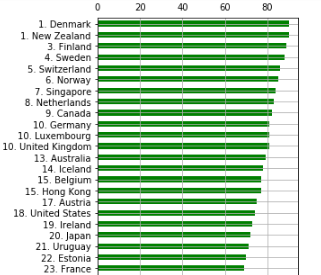
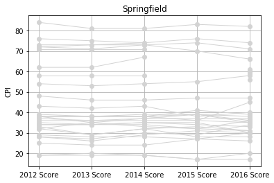
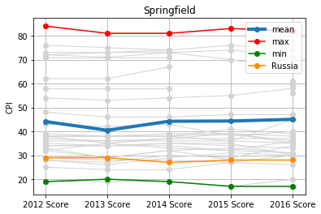
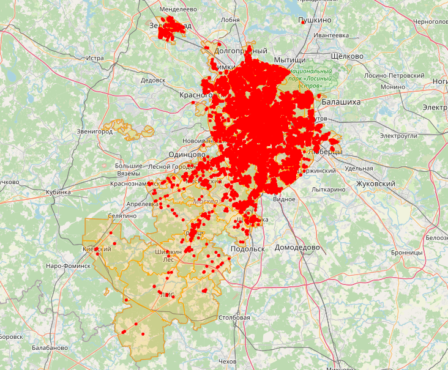

# ЗАДАНИЕ. Дескриптивный анализ данных

Папулин С.Ю. (papulin.study@yandex.ru)

## Цель работы

Приобрести опыт решения практических задач по анализу данных, таких как загрузка, трансформация, вычисление простых статистик и визуализация данных в виде графиков и диаграмм, посредством языка программирования Python.

## Варианты

Чтобы узнать свой вариант, скопируйте код в ячейку jupyter тетради, введите Вашу фамилию в соответствующее поле и запустите ячейку:

```python
surname = "Иванов"  # Ваша фамилия

alp = "абвгдеёжзийклмнопрстуфхцчшщъыьэюя"
w = [1, 4, 21, 25, 34,  6, 44, 26, 13, 44, 38, 26, 4, 43,  4, 49, 46,
        17, 42, 29,  4,  9, 36, 34, 31, 22,  15, 30,  4, 19, 28, 28, 33]

d = dict(zip(alp, w))
variant =  sum([d[el] for el in surname.lower()]) % 40 + 1

print("Задача № 1, шаг 5 - вариант: ", variant % 5 + 1)
```

## Задача 1

Анализ индекса восприятия коррупции (Corruption Perceptions Index, CPI) (6 баллов)

1. Подключите библиотеки numpy, pandas, matplotlib
2. Загрузите данные из "data/CPI2020.xlsx" в DataFrame. Исходные данные и пояснения можно найти [здесь](https://www.transparency.org/en/cpi/2020/index)
3. Отсортируйте данные по убыванию индекса DataFrame
4. Отобразите данные по индексу CPI за 2020 год в виде горизонтального столбчатого графика. Примерный вид графика приведен ниже

<center>



</center>

5. Сформируйте DataFrame из исходного для региона в соответствии с Вашим вариантом:
    - Вариант 1. Asia Pacific
    - Вариант 2. Americas
    - Вариант 3. Europe and Central Asia
    - Вариант 4. Middle East and North Africa
    - Вариант 5. Sub Saharan Africa
6. Выведите данные DataFrame'a региона
7. Постройте графики индекса CPI за 2012-2020 для стран своего региона. Примерный вид графика приведен ниже

<center>



</center>

8. Найдите страны с наибольшим и наименьшим значением CPI Вашего варианта региона за 2020 год
9. Определите средние значения региона за каждый год в период с 2012 по 2020
10. Постройте графики индекса CPI за 2012-2020 для стран своего региона и выделите страны с наибольшим и наименьшим значением CPI за 2020 год, а также отобразите среднее значение по региону и РФ. Примерный вид графика приведен ниже

<center>



</center>

## Задача 2

Визуализация образовательных учреждений Москвы на карте города (баллов 4)

1. Подключите библиотеки numpy, pandas и folium
2. Загрузите данные из "`data/data-54518-2021-10-18.xlsx`" в DataFrame. Исходные данные и пояснения можно найти [здесь](https://data.mos.ru/opendata/7719028495-obrazovatelnye-uchrejdeniya-goroda-moskvy)
3. Выведите список организационно-правовых форм (`LegalOrganization`) для присутствующих в наборе данных учреждений
4. Выведите первые 10 автономных образовательных учреждений
5. Отобразите на карте районы Москвы, используя geojson файл "`data/mo.geojson`" 
6. Добавьте на карту маркеры все образовательных учреждений Москвы, используя значения столбца `geodata_center`. При нажатии на маркер должно отображаться окна с наименованием учреждения, его адресом и веб-адресом. Ниже примерный вид карты

<center>



</center>