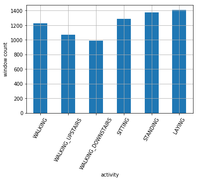
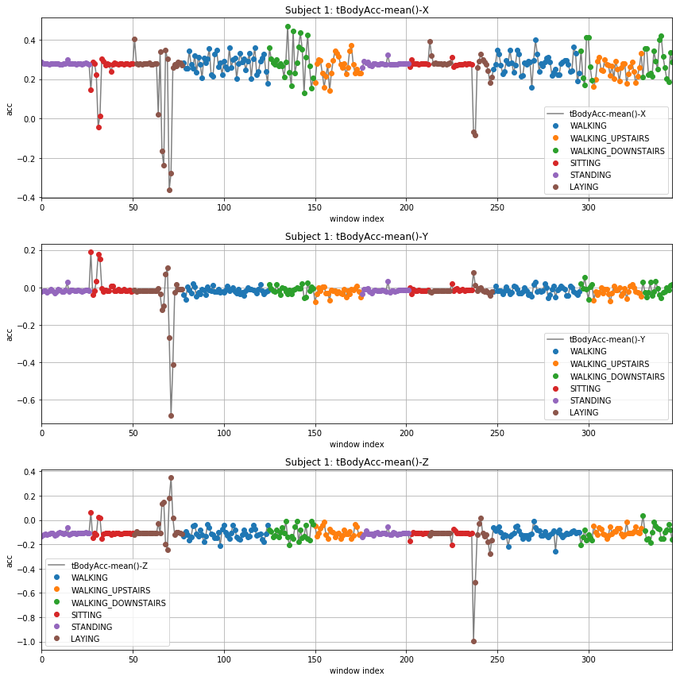
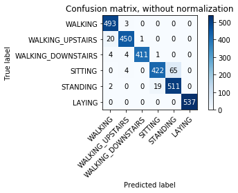

# ЗАДАНИЕ. Классификация данных. Распознавание активности человека (HAR)

Папулин С.Ю. (papulin.study@yandex.ru)

## Набор данных

Описание: [Smartphone-Based Recognition of Human Activities and Postural Transitions Data Set](http://archive.ics.uci.edu/ml/datasets/Smartphone-Based+Recognition+of+Human+Activities+and+Postural+Transitions)

Ссылка: [HAPT Data Set.zip](http://archive.ics.uci.edu/ml/machine-learning-databases/00341/HAPT%20Data%20Set.zip)

## Задача 1. Анализ данных (3 балла)

1. Загрузите наименование активностей и столбцов

    - файл активностей: `activity_labels.txt`
    - файл наименований столбцов: `features.txt`

2. Загрузите обучающее множество с идентификатором испытуемых, признаков и целевых значений (активностей). Сформируйте один датафрейм. В качестве наименований столбцов указать ранее загруженные из файла

    - файл испытуемых: `subject_train.txt`
    - файл признаков: `X_train.txt`
    - файл целевых значений: `y_train.txt`

Пример команды загрузки файла в датафрейм:
```python
pd.read_csv(X_TRAIN_FILE, header=None, sep="\s+", names=CLMS)
```

3. Отобразите количество каждой активности в виде столбчатой диаграммы

Примерный вид диаграммы:
<center>



</center>

4. Для 5го испытуемого отобразите столбчатую диаграмму его активностей (примерный вид как в п.3)


5. Для 5го испытуемого отобразите средние ускорения по всем координатам в виде отдельных `plot` графиков

Примерный вид графиков:
<center>



</center>


## Задача 2. Обучение модели (3 балла)

1. Постройте модель полиномиальной логистической регрессии для распознавания активности

Параметры модели:

```python
penalty="l2", 
max_iter=100, 
solver="newton-cg", 
multi_class="multinomial"
```

2. Загрузите тестовое множество признаков и целевых значений(активностей). Сформируйте один датафрейм. В качестве наименований столбцов указать ранее загруженные из файла

    - файл признаков: `X_test.txt`
    - файл целевых значений: `y_test.txt`

3. Оцените долю правильных классификаций, полноту, точность и F1 построенного классификатора на тестовом множестве

используйте `.score()` и `classification_report`:
```python
from sklearn.metrics import classification_report
```

4. Отобразите матрицу ошибок классификатора с указанием активностей

⚠️ **Замечание.** В зависимости от версии `sklearn`

```python
from sklearn.metrics import plot_confusion_matrix

# или

from sklearn.metrics import ConfusionMatrixDisplay

# или

import sys
sys.path.insert(0, "../lib/")
from plot_confusion_matrix import plot_confusion_matrix
```

Примерный вид матрицы:

<center>



</center>

<!-- 5. Постройте и оцените модель без использования частотных признаков. Как изменится качество классификации?

6. Отобразите матрицу ошибок классификатора с указанием активностей -->


## Задача 3. Выбор модели (4 балла)

- Необходимо построить следующие модели для распознавания активности:
    - k-ближайших соседей: `k=[5,11]`
    - логистическая регрессия: `C=[0.1,10]`
    - случайный лес: `n=[50,100]`, где в скобках указаны возможные значения, из которых необходимо будет выбирать

- Для каждого типа определить лучший параметр с использованием стратифицированной кросс-валидации с `k=3`. В качестве метрики использовать долю правильных классификаций (`accuracy`)

```python
from sklearn.model_selection import StratifiedKFold
```

- Отобразите результаты для лучших моделей в виде датафрейма с указанием параметров моделей

Примерный вид вывода:

<table border="1" class="dataframe">  <thead>    <tr style="text-align: right;">      <th></th>      <th>params</th>      <th>accuracy</th>    </tr>  </thead>  <tbody>    <tr>      <th>KNeighborsClassifier</th>      <td>{'n_neighbors': 5}</td>      <td>0.901934</td>    </tr>    <tr>      <th>LogisticRegression</th>      <td>{'C': 1}</td>      <td>0.961317</td>    </tr>    <tr>      <th>RandomForestClassifier</th>      <td>{'n_estimators': 50}</td>      <td>0.923990</td>    </tr>  </tbody></table>
